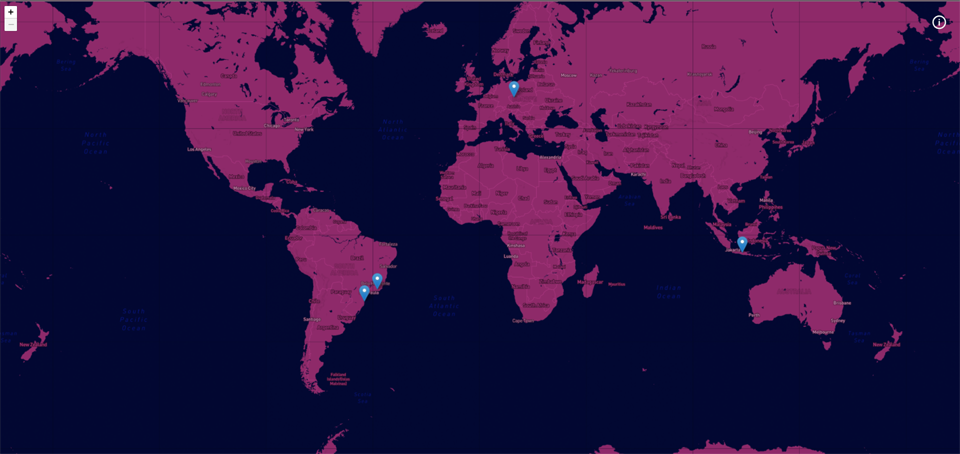

<h1 align="center">:airplane: My trips</h1>

<p align="center">
  

  

  <a href="https://github.com/EdsonCandido73/my-trips/commits/master">
    
  </a>
  
  
</p>




## :memo: Description
My-trips is an interactive platform that allows users to record their travels around the world and create a personalized map with markers representing the places they have visited. By clicking on a marker on the map, a detailed page of the chosen location is displayed, containing photos and descriptions provided by the user.


## :books: How it works
* You will be able to register your places in a CMS, including a description, interesting facts, etc., and upload photos. The location will be added to the interactive map.


## :wrench: Technologies
* This is a [Next.js](https://nextjs.org/) project bootstrapped with [`create-next-app`](https://github.com/vercel/next.js/tree/canary/packages/create-next-app).

Other technologies used in this project:
* [Typescript](https://www.typescriptlang.org/)
* [Leaflet](https://leafletjs.com/)
* [react-leaflet](https://react-leaflet.js.org/)
* [Mapbox](https://www.mapbox.com/)
* [Styled components](https://styled-components.com/)
* [Jest](https://jestjs.io/)
* [GraphQL](https://graphql.org/)
* [GraphQL-Codegen](https://the-guild.dev/graphql/codegen/docs/config-reference/codegen-config)
* [Hygraph CMS](https://app.hygraph.com/)


## :running: Getting Started

First, clone the repository 

Install dependencies:
```bash
yarn install
```

Run the development server:
```bash
yarn dev
```

Open [http://localhost:3000](http://localhost:3000) with your browser to see the result.

## :rocket: Production Deployment

Vercel: [My-trips](https://my-trips-edsoncandido73.vercel.app/)

## License

This project is licensed under the MIT license. See the [LICENSE](LICENSE) file for more details.

---
<sup>Project developed by [Edson Cândido](https://github.com/EdsonCandido73) through the advanced NextJS course - Willian Justen.</sup>
